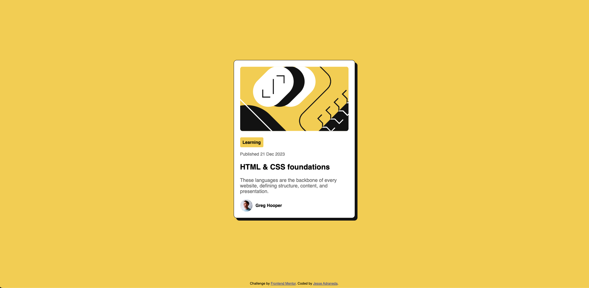

# Frontend Mentor - Blog preview card solution

This is a solution to the [Blog preview card challenge on Frontend Mentor](https://www.frontendmentor.io/challenges/blog-preview-card-ckPaj01IcS). Frontend Mentor challenges help you improve your coding skills by building realistic projects.

## Table of contents

- [Overview](#overview)
  - [The challenge](#the-challenge)
  - [Screenshot](#screenshot)
  - [Links](#links)
- [My process](#my-process)
  - [Built with](#built-with)
  - [What I learned](#what-i-learned)
  - [Continued development](#continued-development)
- [Author](#author)

## Overview

### The challenge

Users should be able to:

- See hover and focus states for all interactive elements on the page

### Screenshot

### Links

- Solution URL: [GitHub Repository](https://github.com/Jessemiel/blog-preview-card)
- Live Site URL: [Live Demo](https://jessemiel.github.io/blog-preview-card/)

## My process

### Built with

- Semantic HTML5 markup
- CSS custom properties
- Flexbox
- Mobile-first workflow

### What I learned

- How to structure semantic HTML with sections, articles, and headers
- How to use `@font-face` to import local fonts
- Creating offset shadows using `box-shadow`
- Flexbox alignment techniques to vertically center content
- How to make pill elements shrink-to-fit content width

### Continued development

I plan to keep practicing:

- Responsive layouts with media queries
- Accessibility best practices
- CSS Grid and layout refinement

## Author

- Frontend Mentor - [@Jessemiel](https://www.frontendmentor.io/profile/Jessemiel)
